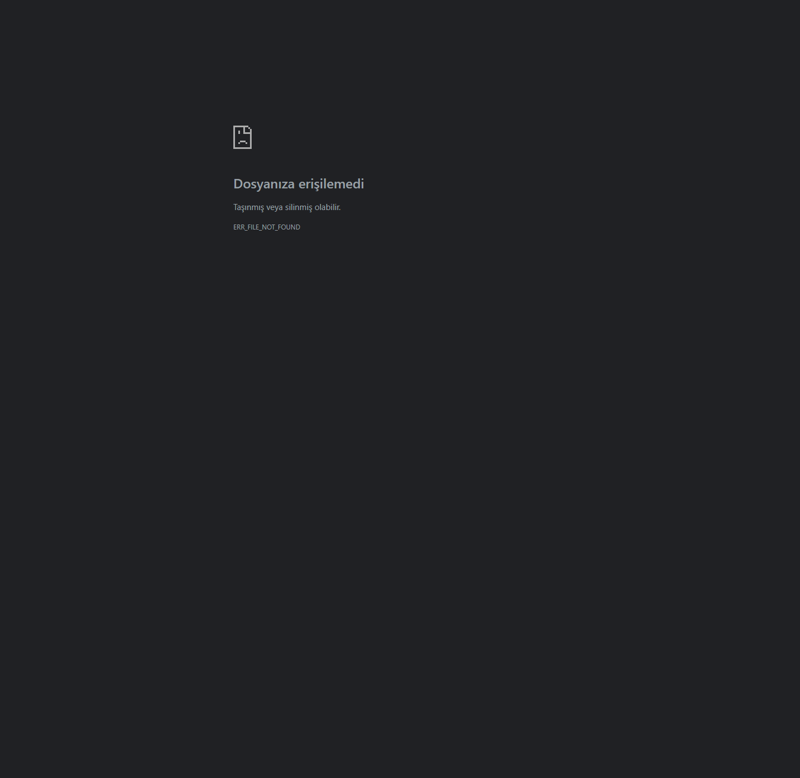

# BatteryLog

BatteryLog is an engineering toolkit for validating EV battery test logs from the command line or Python.

The current version focuses on deterministic CSV analysis, configurable validation rules, structured violation events, explicit validation status, and self-contained HTML evidence reports.

## Why it exists

Battery validation often involves repetitive checks across long measurement logs. BatteryLog turns those checks into reproducible software so violations can be traced to when they happened, how severe they were, and which signals were involved.

## Report preview

The preview below is generated from the repository's vendor-style sample CSV and explicit signal-mapping config.



## Current capabilities

- Analyze CSV battery logs
- Map vendor-specific timestamp, cell-voltage, and temperature channel names into a canonical signal model
- Load validation limits from YAML
- Detect cell overvoltage and undervoltage
- Detect excessive cell-voltage imbalance
- Detect high and low temperature events
- Group consecutive failing samples into one violation event
- Optionally split sparse failing samples using a configurable maximum timestamp gap
- Record event start, end, and worst-case timestamps
- Record measured value, engineering limit, unit, and implicated signals
- Support one or more cell-voltage and temperature signals
- Reject missing, non-numeric, non-finite, or time-disordered required data
- Emit explicit `NOT_EVALUATED`, `PASS`, or `FAIL` validation status
- Report which rules were actually evaluated
- Emit a versioned machine-readable JSON result
- Publish and CI-validate the result contract as Draft 2020-12 JSON Schema
- Generate self-contained HTML validation reports
- Record input/config SHA-256 provenance in HTML reports
- Return CI-friendly process exit codes
- Run as a Python API

## Canonical CSV schema

Without an explicit signal-mapping block, every input must contain:

- `timestamp_s`
- one or more indexed cell-voltage columns named `cell_<n>_v`
- one or more indexed temperature columns named `temp_<n>_c`

Examples are `cell_1_v`, `cell_96_v`, `temp_1_c`, and `temp_24_c`. The legacy single-temperature name `temp_c` is supported only when indexed temperature signals are not present.

Aggregate names such as `cell_min_v`, `cell_max_v`, or `temp_max_c` are intentionally not treated as raw sensor channels.

Example:

```csv
timestamp_s,temp_1_c,temp_2_c,cell_1_v,cell_2_v
0,28,27,3.95,3.94
1,48,46,3.68,3.58
```

`timestamp_s` must be numeric and non-decreasing.

## Explicit signal mapping

Vendor exports do not need to be renamed before analysis. A YAML config can explicitly map source channel names into BatteryLog's canonical model:

```yaml
signals:
  timestamp: Time_s
  cell_voltage:
    pattern: 'BMS_CellVoltage_(?P<index>\d+)'
  temperature:
    pattern: 'T_Module_(?P<index>\d+)'
```

Signal patterns are applied as **full matches**, not substring searches. Both cell-voltage and temperature patterns must define a named `index` capture group containing ASCII digits. The numeric index determines canonical ordering, so source names such as `BMS_CellVoltage_001`, `BMS_CellVoltage_2`, and `BMS_CellVoltage_10` become `cell_1_v`, `cell_2_v`, and `cell_10_v`.

When a `signals` block is present, `timestamp`, `cell_voltage`, and `temperature` are all required. BatteryLog fails closed when:

- the mapped timestamp is missing
- a pattern matches no required channels
- two source channels resolve to the same logical index
- one source channel matches both sensor patterns
- the timestamp also matches a sensor pattern
- source signal names are duplicated

Extra columns that do not match the explicit patterns are not part of the canonical battery-signal model. For example, `BMS_CellVoltage_Max` is not selected by the numeric-index pattern above.

Signal mapping performs **naming/canonicalization only**. It does not convert units. CSV values must already use:

- seconds for the timestamp
- volts for cell voltage
- degrees Celsius for temperature

Violation events use canonical names such as `cell_1_v` and `temp_2_c`. The machine-readable result and HTML report record whether canonical or explicit mapping was used, along with the source timestamp and configured patterns.

A tested vendor-style example is included:

```powershell
.\.venv\Scripts\batterylog.exe examples\vendor_battery_log.csv --config examples\vendor_mapping.example.yaml
```

## Validation rules

BatteryLog currently emits these rule codes:

| Code | Condition |
| --- | --- |
| `CELL_IMBALANCE_HIGH` | per-row max cell voltage minus min cell voltage is above the configured limit |
| `CELL_OVERVOLTAGE` | at least one cell is above the configured maximum voltage |
| `CELL_UNDERVOLTAGE` | at least one cell is below the configured minimum voltage |
| `TEMPERATURE_HIGH` | at least one temperature signal is above the configured maximum |
| `TEMPERATURE_LOW` | at least one temperature signal is below the configured minimum |

A rule can be disabled by setting its YAML value to `null`.

## YAML configuration

Example:

```yaml
schema_version: 1

limits:
  cell_voltage:
    min_v: 2.8
    max_v: 4.2
    max_delta_v: 0.08

  temperature:
    min_c: -20
    max_c: 55

event_detection:
  max_gap_s: 2.0
```

The values in `examples/validation.example.yaml` are illustrative only. They are not universal safety limits or chemistry defaults. Validation limits must come from the tested cell/pack specification, operating state, BMS strategy, and test plan.

BatteryLog does not assume universal engineering limits. If no YAML config or explicit CLI/Python threshold is supplied, it computes metrics only and emits no validation violations.

This is deliberate: voltage, temperature, and imbalance limits must come from the applicable cell/pack specification and validation plan rather than from generic tool defaults.

Precedence is:

```text
CLI numeric override / CLI explicit disable > YAML config
```

A rule is active only when its effective limit is numeric. A YAML value of `null` disables that rule, and the CLI can explicitly disable an active YAML rule with the corresponding `--no-*` option.

Unknown config keys are rejected instead of silently ignored, so spelling mistakes do not disable a validation rule unnoticed.

The `event_detection.max_gap_s` value controls event segmentation only. It is not a battery safety limit. When configured, adjacent failing rows are kept in the same event only when their timestamp gap is less than or equal to the configured value. A larger gap starts a new event.

If `max_gap_s` is omitted or `null`, BatteryLog preserves the original row-contiguity behavior.

## Numerical comparison semantics

Validation limits use strict engineering boundaries:

- high-limit rules violate only when the measured value is strictly greater than the configured limit
- low-limit rules violate only when the measured value is strictly less than the configured limit
- a value on the configured boundary is not a violation

BatteryLog applies a very small binary64 representation guard when deciding whether a computed floating-point value is effectively on the boundary. The relative guard is fixed at `8 * float64 epsilon` (approximately `1.776e-15`), while the absolute tolerance is `0.0`. This avoids applying one unit-dependent absolute allowance across volts, degrees Celsius, and seconds.

This guard is **not** an engineering tolerance, sensor accuracy allowance, hysteresis, or calibration margin. Those belong in the test specification and must be reflected in the configured engineering limits themselves.

The same comparison policy is used for cell overvoltage, cell undervoltage, cell imbalance, high/low temperature, and maximum event-gap boundaries. The effective policy is included in the machine-readable result as `comparison_policy` and rendered in HTML reports.

Cell-delta values may still be rounded for serialized/display output to suppress unreadable subtraction artifacts; that presentation normalization does not participate in the validation decision.

## Validation status

BatteryLog separates "no violations" from "no validation was performed":

| Status | Meaning |
| --- | --- |
| `NOT_EVALUATED` | no engineering rule had an active numeric limit; metrics were computed only |
| `PASS` | at least one engineering rule was evaluated and no violations were found |
| `FAIL` | at least one evaluated rule produced a violation |

The result also contains `rules_evaluated`, so downstream reports can show exactly which checks participated in the status decision.

## Result schema

Machine-readable results include a separate `schema_version`. The current result schema is `1`.

The formal Draft 2020-12 JSON Schema is published at [`batterylog/schema/result-v1.json`](batterylog/schema/result-v1.json) and is included in the Python distribution package. CI validates generated `NOT_EVALUATED`, `PASS`, and `FAIL` results against this artifact.

The schema rejects unknown top-level/nested fields and encodes status invariants such as:

- `NOT_EVALUATED`: no rules evaluated and no violation events
- `PASS`: at least one rule evaluated and no violation events
- `FAIL`: at least one rule evaluated and at least one violation event

Package versions and result-schema versions are intentionally independent. Package or implementation changes that do not alter the machine-readable payload may keep result schema version `1`. Because schema v1 is strict and rejects unknown fields, adding, removing, renaming, or changing the meaning/type of result fields requires a new versioned schema artifact and a new `schema_version`.

## Event semantics

A violation is not reported once per failing row. By default, consecutive failing rows are grouped into one event. When `event_detection.max_gap_s` is configured, a timestamp gap greater than that value starts a new event even if no passing row exists between the samples. A gap exactly on the configured boundary remains in the same event.

Each event stores:

- `start_time_s`: first failing sample
- `end_time_s`: last consecutive failing sample
- `peak_time_s`: timestamp of the worst value in the event
- `measured_value`: worst value reached
- `limit_value`: configured engineering threshold
- `unit`: engineering unit for the rule
- `signals`: signal or signals responsible for the worst value

Example:

```json
{
  "code": "CELL_OVERVOLTAGE",
  "start_time_s": 120.1,
  "end_time_s": 120.4,
  "peak_time_s": 120.3,
  "measured_value": 4.24,
  "limit_value": 4.2,
  "unit": "V",
  "signals": ["cell_23_v"]
}
```

## Development setup

```powershell
python -m venv .venv
.\.venv\Scripts\python.exe -m pip install -e ".[dev]"
```

Run the quality gate:

```powershell
.\.venv\Scripts\python.exe -m ruff format --check .
.\.venv\Scripts\python.exe -m ruff check .
.\.venv\Scripts\python.exe -m pip check
.\.venv\Scripts\python.exe -m pytest -q --cov=batterylog --cov-fail-under=95
```

Run the synthetic worst-case event-construction benchmark separately from CI:

```powershell
.\.venv\Scripts\python.exe benchmarks\benchmark_event_builders.py --rows 300000 --signals 20
```

The benchmark intentionally creates many short events. It is a profiling aid, not a pass/fail CI timing gate.

## CLI usage

Compute metrics only, without assuming engineering limits:

```powershell
.\.venv\Scripts\batterylog.exe examples\sample_battery_log.csv
```

Use a YAML config with canonical signals:

```powershell
.\.venv\Scripts\batterylog.exe examples\sample_battery_log.csv --config examples\validation.example.yaml
```

Analyze a vendor-style CSV through explicit signal mapping:

```powershell
.\.venv\Scripts\batterylog.exe examples\vendor_battery_log.csv --config examples\vendor_mapping.example.yaml
```

Override YAML values from the CLI:

```powershell
.\.venv\Scripts\batterylog.exe examples\sample_battery_log.csv --config examples\validation.example.yaml --cell-max-v 4.15 --temp-max-c 50 --max-event-gap-s 0.5
```

Disable rules that are active in YAML:

```powershell
.\.venv\Scripts\batterylog.exe examples\sample_battery_log.csv --config examples\validation.example.yaml --no-cell-max-v --no-temp-max-c
```

Available disable options are `--no-cell-min-v`, `--no-cell-max-v`, `--no-imbalance-limit-v`, `--no-temp-min-c`, and `--no-temp-max-c`.

The existing `--temp-warning-c` option remains available as an alias for `--temp-max-c`; `--no-temp-warning-c` is likewise an alias for `--no-temp-max-c`. A numeric override and its matching disable option are mutually exclusive and produce a CLI usage error when supplied together.

Generate a self-contained HTML report:

```powershell
.\.venv\Scripts\batterylog.exe examples\sample_battery_log.csv --config examples\validation.example.yaml --report battery-report.html
```

The report contains the validation status, dataset summary, measured extrema, effective limits, evaluated rules, signal-mapping provenance, violation events, BatteryLog version, result-schema version, UTC generation timestamp, and SHA-256 provenance for the input log and optional YAML config.

The report path is not allowed to overwrite the input log or validation config.

## Process exit codes

| Exit code | Meaning |
| ---: | --- |
| `0` | at least one rule was evaluated and all evaluated rules passed |
| `1` | validation completed and at least one evaluated rule failed |
| `2` | input, configuration, CLI, or report-generation error |
| `3` | metrics were computed but no engineering rule was evaluated |

This allows CI/HIL pipelines to distinguish a true PASS from a validation failure or an unevaluated dataset without parsing the JSON payload.

## Python API

```python
from batterylog import EventDetectionConfig, ValidationLimits, analyze_battery_log

limits = ValidationLimits(
    cell_min_v=2.8,
    cell_max_v=4.2,
    imbalance_max_v=0.08,
    temperature_min_c=-20,
    temperature_max_c=55,
)

result = analyze_battery_log(
    "examples/sample_battery_log.csv",
    limits=limits,
    event_detection=EventDetectionConfig(max_gap_s=0.5),
)

for event in result["violations"]:
    print(event["code"], event["peak_time_s"], event["signals"])
```

YAML can also be loaded programmatically:

```python
from batterylog import analyze_battery_log, load_validation_config

config = load_validation_config("examples/validation.example.yaml")
result = analyze_battery_log(
    "test.csv",
    limits=config.limits,
    event_detection=config.event_detection,
    signal_mapping=config.signals,
)
```

The older `load_validation_limits()` helper remains available for callers that intentionally need only the engineering-limit portion of a config file.

The legacy `imbalance_limit_v` and `temp_warning_c` arguments to `analyze_battery_log()` are deprecated and emit `DeprecationWarning`. New code should construct `ValidationLimits` and pass it through `limits=`. During the compatibility period, a supplied legacy value overrides the corresponding field from `limits=`.

## Engineering notes

The analyzer fails closed on invalid required sensor values. A missing cell or temperature sample is treated as invalid input instead of being silently excluded from min/max calculations, because silently skipping a signal can hide a real validation failure. The validation error identifies the first failing data row, column, and value to make large-log diagnosis practical.

Event grouping uses row contiguity by default and can optionally split sparse failures with `event_detection.max_gap_s`.

Signal mapping deliberately does not infer units or perform unit conversion. Future loaders that expose measurement-unit metadata should validate units explicitly before the canonical data reaches the rule engine.

HTML evidence generation hashes the source/config before analysis and re-hashes them afterwards. A metadata-only size/mtime check is not used as the final provenance guard.

The current CSV loader still materializes the complete file in memory. The event-construction hot path is optimized, but multi-million-row bounded-memory processing requires the separate streaming work planned for large-log support.

Planned follow-on work includes report plots, MF4/MDF support, CAN/DBC decoding, richer rule metadata, automated release artifacts, and larger-log processing.

## Status

Early MVP. The API may change while the validation model is expanded.
