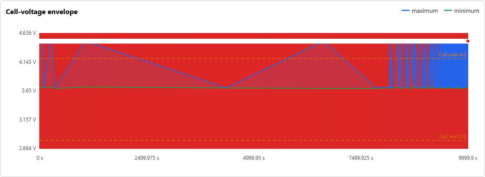
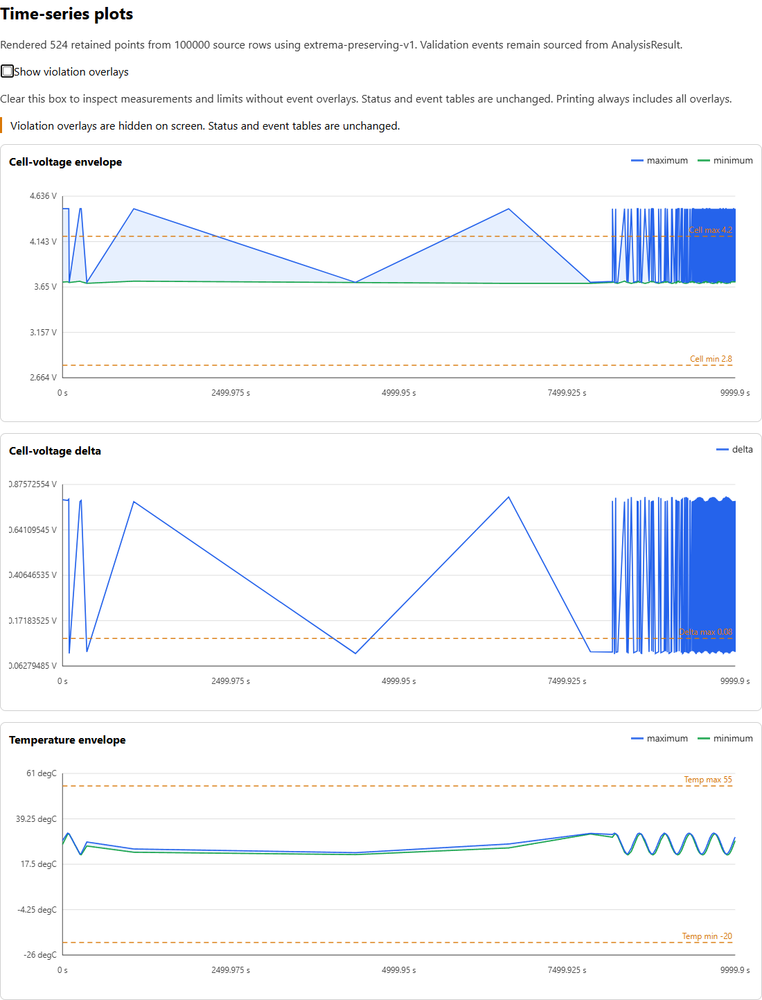

# Native chart overlay review — 2026-10-01

Fixed input: draft [PR #104](https://github.com/CANWECAN/BatteryLog/pull/104),
head `5dde0781adbf941aac63d605dc88e0f7ab55d193`, tree
`5739d2550b32a72ef373ca6ab786028f57345656`.
Work is isolated on `fix/0.10-chart-review`. This block starts at 22:37:53 Istanbul,
with a 23:22:53 target.

Code commit: `71b20370cf492fc342089d62f499314773fee715`.
Code tree: `ccfa80ef3686d5734f19b805c4fbe6f8310ebdd9`.
The documentation checkpoint preserves this runtime code. Final-head CI and
the tested merge-tree identity are recorded on the associated draft PR.

This addresses a confirmed chart-reading problem. It does not reduce event-scaled
SVG/file/memory growth, close human workflow acceptance, or authorize a release.

## Problem and resulting behavior

The retained synthetic MF4 pressure input contains 100,000 rows, four cell and
two temperature channels in two groups. The first cell alternates 4.5/3.7 V.
With the existing limits, 50,000 overvoltage and 50,000 imbalance events produce
100,000 windows/instant lines and 100,000 peak circles, with one title per peak.
Dense red overlays and markers obscure the chart background and some line/label
detail. The original report has no way to inspect the measurement geometry
without these overlays.

The report now offers a native **Show violation overlays** checkbox whenever
plot data and engineering violation events exist. It is checked by default.
Clearing it hides only windows, instant lines and peak markers on screen.
Measurement series, envelopes, axes, configured limits, plot domains and
downsampling remain unchanged. A visible notice states that overlays are hidden.
Status and event tables, including their current filters/page state, do not change.

Printing always restores full overlays and hides the interactive controls/notice.
The chart control works without JavaScript; large-table paging still needs it
as before. Reports without engineering events, or without plot data, omit the
control. Complete SVG attributes, titles, embedded event records and canonical
JSON are retained.

Implementation: 13 added renderer lines and ten added CSS lines. A native
checkbox and existing plot classes use CSS3 checked/sibling selectors restricted
to screen media; print styles hide the controls. There is no new JavaScript,
runtime dependency, event aggregation, decimation or plotting framework.
The [W3C selector specification](https://www.w3.org/TR/selectors-3/#checked) and
[media-query specification](https://www.w3.org/TR/mediaqueries-4/#media-types)
define the state/media mechanisms. Actual compatibility observations below are
limited to the installed Edge browser.

## Visual evidence

[Input observation](benchmarks/0.10-chart-overlay-before.json): 100,000 events,
200,000 overlay elements, 301,630 DOM nodes, 56,961,060 HTML bytes, no control.

The original first chart, captured before changing runtime code:



The new screen view below has the control cleared and the explicit hidden-state
notice visible. It contains all three charts. It is an inspection view of the
retained geometry, not a change to the analysis or an assertion that all source
samples are displayed. The existing sampling note remains visible.



## Browser verification

Host: Windows 11 / Ryzen 5 7500F class / 16 GB / Python 3.13.14.
Edge 154.0.4258.48, fresh headless profiles, 1440 x 1000.
Non-file requests are blocked; no dataset or browser download is required.

[Final observations](benchmarks/0.10-chart-overlay-after.json) cover:

- A valid four-row CSV exercising all seven chart types and nine engineering
  events, with JavaScript enabled and disabled in separate browser sessions.
- Three fresh browser sessions using the actual 100,000-event MF4 CLI report.
- Checked default; Space toggles the focused checkbox without losing focus;
  clicking its label restores overlays.
- Every retained overlay's computed display becomes hidden/restored as expected.
  Measurement series and configured limit lines stay visible.
- Complete serialized SVGs equal the parent report. Native state changes leave
  SVG DOM serialization unchanged. No record/geometry is deleted.
- Both table contents and global FAIL remain unchanged; the large report stays
  on matching events 99,901–100,000 while the checkbox is toggled.
- Print-media styles restore every overlay even when the checkbox is unchecked,
  hide controls/notice, and return to the hidden screen view afterward.
- All sessions finish without page errors or the resource guard firing.

The large reports retain 200,000 overlay elements. Median hide-and-verify time
is 2.338 seconds (observations 2.317/2.621/2.338). This includes native input,
state assertions and computed-style checks on every overlay; it is **not an
isolated user-visible toggle latency or a speedup measurement**.
Median sampled owned-Edge working-set sum peak is 2,130,440,192 bytes.
This includes shared pages and diagnostic serialization work, is sampled every
200 ms, and is not unique physical memory or a hard bound. The final sessions
stop above a 4 GiB owned sum or below 1 GiB global available memory and can kill
only their own Edge descendants. The single input capture has no comparable RSS
measurement. No memory improvement is claimed.

Print observations verify browser print-media rendering styles; this block does
not stress-test a 100,000-event PDF export or a physical printer. Native
screen-reader interaction, Firefox and Safari are not verified. A human test
engineer has not accepted the workflow based on this diagnostic alone.

## Regression, artifact and real-data checks

Four new render cases verify a labelled, described, checked native control with
complete event markers and unchanged caller result, plus omitted controls for
PASS, NOT_EVALUATED and all-excluded FAIL. Focused plot/report/pager tests pass
88 cases. The [previous pager diagnostic](benchmarks/0.10-chart-pager-recheck.json)
also passes after the CSS change, including both boundary-focus fixes,
independent filters, one-based row intervals, literal text, print and no-JS notices.

Full Windows suite: **1,315 passed, one Linux-only skip, four expected warnings**,
63.47 seconds; **98.61%** Python coverage. Ruff format/lint, package-wide mypy
with existing CI flags, pip check and wheel/sdist build pass. Python coverage
does not measure CSS/inline JavaScript behavior.

[The built wheel](benchmarks/0.10-chart-wheel.json) has SHA-256
`17fef86bcda7b64c9e3f9fe82d39b7c276de98da82bd8dde301f4d1c133f11d1`;
all 32 Python files equal the frozen source. It is installed with `--no-deps`
into a new target directory using existing venv dependencies. Subprocesses run
outside the checkout and assert the target import path. This proves installed
code behavior, not a fresh local dependency environment; CI covers fresh installs.

[Installed-wheel CORA observations](benchmarks/0.10-cora-cycle229-chart-review.json):
three retained cycle-229 branch CSVs, 16,365 rows each, 49,095 branch rows total.
Complete results equal the PR #104 baseline and stdout equals the JSON file.
Branches retain 457/477/399 events, six charts, zero excluded rows and exact
last-page pack/cell-sum/signed-error evidence. Native overlay hiding preserves
page state; print-media styles restore markers. No browser errors occur.
The illustrative 0.15 V threshold characterizes software behavior and produces
expected FAIL/exit 1; it is not battery acceptance. The full 410-file campaign
was not rerun. The temporary CORA diagnostic copy changes root/output location
and adds explicit overlay/print assertions; the reusable parent script is intact.

## Reproduction and own corrections

The optional scripts require the already retained synthetic MF4 at
`../BatteryLog-report-review/dist/report-review/pressure-100000.mf4`,
Playwright, psutil and installed Edge. They are development diagnostics, not
BatteryLog runtime dependencies. From this worktree, use the readiness Python:

```powershell
$reviewPython = '..\BatteryLog-release-readiness\.venv\Scripts\python.exe'
$env:PYTHONPATH = (Resolve-Path '..\BatteryLog-retrospective-review').Path
& $reviewPython benchmarks\review_chart_overlays_before.py
$env:PYTHONPATH = (Get-Location).Path
& $reviewPython benchmarks\review_chart_overlays.py
```

The first command must import the fixed PR #104 source; its no-control assertion
protects that requirement. The second analyzes the same source and compares full
result dictionaries and all serialized SVGs before running native UI assertions.
No download is performed. Baseline capture is a single browser run; guarded
resource sampling applies to the final after-change sessions.

An early diagnostic marked unchecked small-table state as false in its output.
The final diagnostic explicitly compares both tables in every workload and
records successful preservation. I also changed “tables always include all
events” to “tables are unchanged”, because filters/paging can limit the visible
table independently of this control.

Two text edits were rejected after Ruff normalized quote styles; the files were
re-read before applying the exact final edits. The copied baseline helper's
import spacing failed Ruff once and was corrected before commit. These were
diagnostic/editing mistakes, not BatteryLog analysis failures.

Prior worktrees and the user's existing release-engineering modifications remain
preserved. Only the new review worktree is expected to be clean at completion.
Main, release version and tags are not changed. SVG/serialized-result growth,
independent engineering-rule acceptance and human workflow acceptance remain open.
