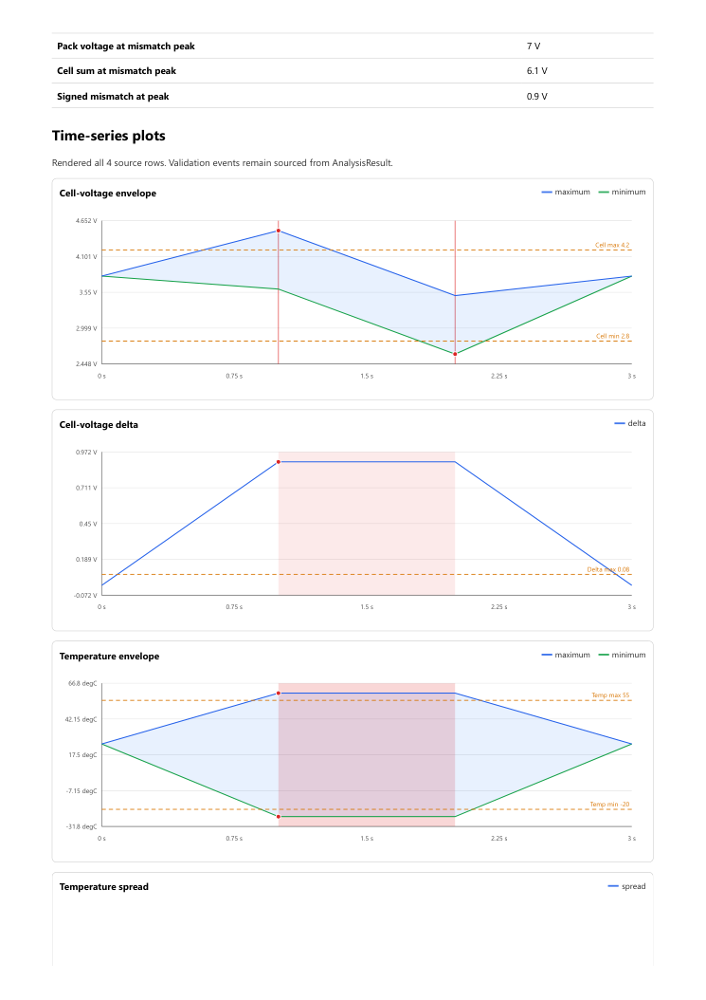
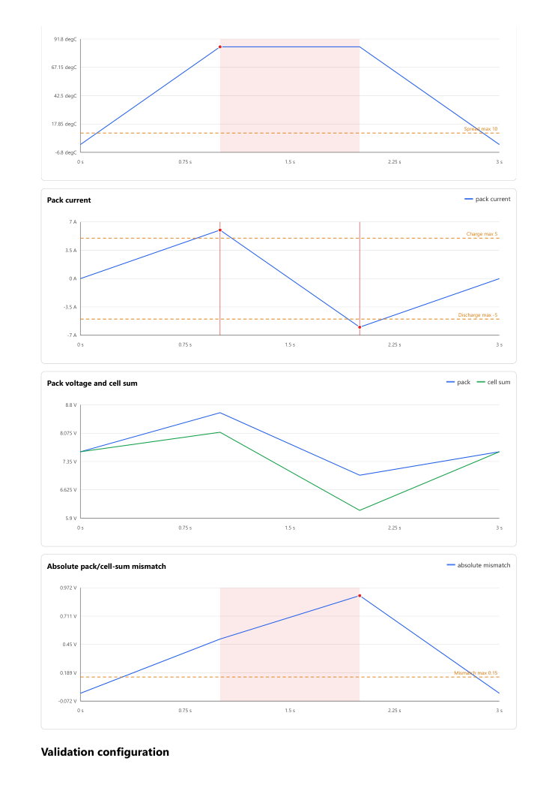
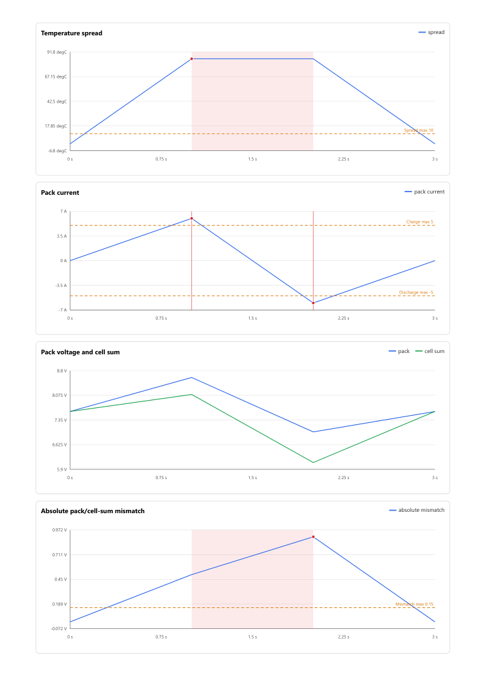

# Rapor baskı/PDF incelemesi - 2026-10-02

Bu periyot A4 çıktıda doğrulanan bir grafik bölünmesini düzeltti.
Yoğun raporların PDF yükü ve insan tarafından iş akışı kabulü açık kaldı.
Yayın, main birleştirmesi, sürüm değişikliği veya etiket oluşturma yapılmadı.

Başlangıç: taslak [PR #108](https://github.com/CANWECAN/BatteryLog/pull/108),
`f261965cf82fc5c258632ffb68e423013fff7712`.
Ayrı çalışma dalı: `fix/0.10-print-review`.
Uygulama kodu/paket kontrol noktası:
`2820bf32a28fdcee7e769d2941c43c38abe55798`,
ağaç `4dd4ae0fcd2dfe95cfef2530e9e4d13abb4dc27e`.
Son PDF doğrulama betiği:
`7505d19c58e85efd9aa2e787fba74de4ee294aa5`.
İkinci kontrol noktası uygulama kodunu ve Python testlerini değiştirmez.
Son dokümantasyon başlığının CI ve test edilen merge ağacı taslak PR'da kaydedilir.

## Doğrulanan hata ve küçük düzeltme

Yedi grafik türünü içeren dört satırlık CSV raporunda, A4 PDF'nin ikinci
sayfası "Temperature spread" başlığıyla bitiyordu. Grafiğin eksenleri ve
ölçüm çizgileri üçüncü sayfada kalıyordu. Bu, grafiği başlığından ayırıyordu.
Başlık sayfa 2 / ayırt edici "91.8 degC" eksen yazısı sayfa 3 olarak hem
gerçek PDF görüntülerinde hem metin çıkarımında doğrulandı.

Önceki ikinci sayfa:



Önceki üçüncü sayfa:



`batterylog/reporting/html.py` içinde yalnızca iki baskı stili eklendi:

- Grafik kartı: `break-inside: avoid`.
- SVG grafiği: `min-width: 0`.

İlk kural bu örnekte başlık ve grafiğin aynı sayfada kalmasını sağlıyor.
İkincisi ekran için gereken 680 px alt genişliği baskıda kaldırıyor.
718 px kontrol görünümünde grafik kartının iç genişliği 652 px;
önceki 704 px taşan içerik son durumda 652 px oluyor.
Ekranda 680 px alt genişlik korunuyor.
[CSS parçalanma standardı](https://www.w3.org/TR/css-break-3/#break-within)
bu baskı mekanizmasını tanımlar. Sayfadan büyük içerikler için mutlak bir
bölünmeme garantisi verilmez.

Son üçüncü sayfa; başlık ve aynı eksen yazısı artık sayfa 3'te:



Yeni bileşen, JavaScript, çalışma bağımlılığı, dış servis veya kamuya açık API yok.
Olay azaltma veya grafik verisi kaybı yok. Grafik/olay/hesaplama kuralları değişmedi.

## Gerçek PDF kontrolleri

Windows 11, Python 3.13.14, Edge 154.0.4258.48, PyMuPDF 1.28.2.
Her durum yeni ve başsız Edge oturumunda çalıştırıldı; dosya dışındaki ağ
istekleri engellendi. A4 dikey, dört yönde 10 mm kenar boşluğu kullanıldı.
Son ölçüm oturumları sırayla çalıştı; aynı anda yerel test veya build çalışmadı.

| Girdi | Grafik | Olay | Önce / sonra PDF sayfası | Önce / sonra PDF boyutu |
| --- | ---: | ---: | ---: | ---: |
| Dört satırlık CSV | 7 | 9 | 5 / 5 | 111.556 / 110.051 bayt |
| Saklanan sentetik MF4 sonucu/serisi | 3 | 100.000 | 7 / 7 | 55.571.558 / 55.571.558 bayt |

Küçük son PDF'nin beş sayfası görsel olarak incelendi. Başlık ayrılması giderildi;
grafik çizgileri, limitler, olaylar, tablo sütunları ve pack/cell-sum kanıtı görüldü.
Büyük PDF'de grafikler, yazdırılan aralık uyarısı ve son olay satırı incelendi.
Yoğun kırmızı bindirmeler baskıda hâlâ yoğun; bu düzeltme o sorunu çözmüyor.

100.000 olaylı HTML'nin son olay sayfası seçildi: 99.901-100.000 / 100.000,
sayfa 1000 / 1000. PDF bu görünen 100 olayı içerir. "Printing includes the
displayed page only" uyarısı PDF'de kalır; bütün 100.000 olayın PDF'de olduğu
iddia edilmez. Tam liste HTML'nin gömülü verisinde korunur.
Son olayın 11 hücresi hem HTML tablosunda hem PDF'nin son sayfasında eşleştirildi;
yalnızca yerleşimin eklediği boşluklar kaldırıldı. Son zaman 9999.8 s'dir.
PDF metninde her iki kural kodu 52 defa görülür: 50 olay, bir özet, bir kural listesi.

[Önce](benchmarks/0.10-report-print-before.json),
[sonra](benchmarks/0.10-report-print-after.json) ve
[kimlik/doğrulama kayıtları](benchmarks/0.10-report-print-identity.json)
tekil süreleri, PDF karmalarını ve bellek gözlemlerini içerir.
Büyük PDF üretimi bu denemelerde yaklaşık bir dakika, dosya yaklaşık 56 MB.
Hız veya bellek iyileşmesi iddiası yok. 200 ms örneklenen, yalnızca bu betiğin
Edge alt süreçlerinin çalışma kümeleri toplamı ortak sayfaları da içerir;
benzersiz fiziksel bellek veya kesin üst sınır değildir.
Deney 4 GiB Edge toplamı, 1 GiB boş sistem belleği veya 150 saniye eşiğinde
yalnızca kendi Edge süreçlerini durdurabilir. Bu eşikler son oturumlarda tetiklenmedi.

## Veri, paket ve geriye dönük kontroller

[Sabit HTML karşılaştırması](benchmarks/0.10-report-print-parity.json):
iki rapor da eklenen iki baskı kuralı çıkarılınca ebeveyn HTML ile birebir aynı.
Bütün SVG, olay JSON'u, durum, metrik, filtre ve tablo içeriği korunuyor.
Bu blokta MF4 çözümleme veya CORA veri kampanyası tekrar çalıştırılmadı;
önceki doğrulanmış MF4 sonuç/seri anlık görüntüsü yeniden kullanıldı.

[Windows kontrolleri](benchmarks/0.10-report-print-checks.json):
1.393 geçti, bir Linux'a özgü atlama, dört beklenen taşma uyarısı;
68,47 saniye, %98,6179 Python kapsamı.
Biçim, Ruff, 32 kaynakta mypy, bağımlılık tutarlılığı ve diff kontrolü geçti.
Bu küçük CSS değişikliği için CSS metnini tekrar eden Python testleri eklenmedi;
`benchmarks/review_report_print.py` gerçek tarayıcı/PDF davranışını kontrol eder.
Python kapsamı CSS veya tarayıcı davranışının kapsamı değildir.

[Paket kaydı](benchmarks/0.10-report-print-package.json):
wheel ve sdist içindeki 32 Python dosyası sabit kaynakla birebir aynı.
Wheel SHA-256:
`cbef400eb99baf49b4807bee2374474a95e19c363f8994a9a861286e73310ac3`.
Sdist SHA-256:
`502805069f4d60a88f2f92c68031475484d2ba5b5569872338b8075cc21bef86`.
Yeni hedefe `--no-deps` ile kuruldu; mevcut venv bağımlılıkları kullanıldı.
PDF kontrolleri checkout dışında çalışıp gerçek kurulu modül yolunu ve
0.10.0.dev0 dağıtım kimliğini doğruladı. Yerel kurulum bağımsız bağımlılık
ortamı değildir; taze kurulumlar CI'da ayrıca kontrol edilir.
Son doğrulama betiği değişiklikleri paketlenen uygulama kaynaklarını değiştirmedi.

## Tekrar çalıştırma ve kendi hatalarım

Saklanan girişler aynı products klasöründe bulunmalıdır:
önceki chart-review küçük HTML'si, allocation-review sabit büyük HTML'si ve
boundary-hunt MF4 sonuç/seri anlık görüntüsü. Betik bu dosyaları indirmez.
Playwright, psutil ve kurulu Edge yalnızca geliştirme kontrolü içindir.
PyMuPDF çalışma bağımlılığına eklenmez; ayrı `dist/print-review/pdf-tools`
hedefine kurulmuştur.

```powershell
$printPython = '..\BatteryLog-release-readiness\.venv\Scripts\python.exe'
& $printPython -m pip install --target dist\print-review\pdf-tools PyMuPDF==1.28.2
& $printPython -m build --outdir dist\print-review
& $printPython -m pip install --no-deps --target dist\print-review\installed-wheel-final dist\print-review\batterylog-0.10.0.dev0-py3-none-any.whl
$env:PYTHONPATH = (Resolve-Path dist\print-review\installed-wheel-final).Path
Push-Location dist\print-review
& '..\..\..\BatteryLog-release-readiness\.venv\Scripts\python.exe' '..\..\benchmarks\review_report_print.py' before
& '..\..\..\BatteryLog-release-readiness\.venv\Scripts\python.exe' '..\..\benchmarks\review_report_print.py' after
Pop-Location
```

Yeni hedef klasörü boş olmalıdır; mevcut kurulumun üzerine aynı komutu çalıştırmak
eski dosyaları bırakabilir. JSON gözlemleri ve PDF/PNG'ler dist altında oluşturulur.

İlk PDF başlık aramam benzer metrik/limit ifadelerini de eşleştiriyordu.
Kurulu paket kontrolü bu yanlış doğrulamayı düşürdü; tam başlık satırına geçtim.
İlk son-olay kontrolü kaba bir sayı aramasına dayanıyordu ve yanlış eşleşmeye
açıktı. Son olayın bütün 11 hücresini eşleştirerek değiştirdim ve tekrar çalıştırdım.
Ruff ayrıca yardımcı betikteki döngü kapanımlarını yakaladı; değişkenleri her
oturuma bağladım ve süreç listesini okurken süreç sonlanmasını yakaladım.
Bunlar kontrol betiğimdeki hatalardı; gizlenmiş uygulama düzeltmeleri değildir.
İlk eşzamanlı test/PDF denemesinin süreleri son kanıt olarak kullanılmadı.

## Açık kalan işler ve sınırlar

SVG/DOM ve gömülü olay verisinin olay sayısıyla büyümesi hâlâ açık.
Büyük PDF'nin dosya ve üretim yükü görüldü; yayın engeli kapanmış sayılmıyor.
Geniş tablolar A4'te yoğun; gerçek test mühendisi ve fiziksel baskı okunabilirliği
kabulü yok. Firefox, Safari, başka kağıt düzenleri ve bağımsız mühendislik
kuralı kabulü bu kontrolün kapsamına girmez.

Kullanıcının release-engineering çalışma dosyaları korundu.
Main başlangıç kimliği `fe02dd7af44b5e0f16badaee6887d3723b4914c1`,
son yayın v0.9.2; periyot sonunda tekrar doğrulanır.
